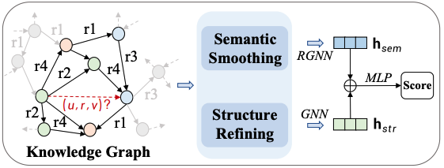

# S<sup>2</sup>DN - Learning to Denoise Unconvincing Knowledge for Inductive Knowledge Graph Completion

This is the code necessary to run experiments on the S<sup>2</sup>DN algorithm described in the paper [Semantic Structure-aware Denoising Network](https://arxiv.org/abs/2412.15822).

## Abstract
Inductive knowledge graph completion (KGC) aims at inferring missing facts between emerging entities, which are not observed in the training phase and have become a critical challenge. Recent works have achieved promising performance for inferring emerging entities by knowledge subgraph reasoning. However, the semantic inconsistency and noise interactions hiding in the knowledge graphs are ignored by these works, which limits the prediction performance and robustness of the inductive KGC task. To address this limitation, we propose a Semantic Structure-aware Denoising Network for robust inductive KGC, called SDN. We are motivated to learn adaptive general semantics and reliable structures to distill consistent semantic knowledge and keep reliable interactions. Specifically, we design a semantic smoothing module within the enclosing subgraphs preserving the universal knowledge of knowledge graph relations. To model the robust structure of the target links, we introduce the structure refined module to filter unreliable interactions and offer additional knowledge. Extensive experiments on three benchmark knowledge graphs demonstrate that SDN outperforms the state-of-the-art models, and verify the effectiveness of keeping semantic consistency and the robustness of denoising unreliable interactions on the contaminated KGs.



## Requiremetns

All the required packages can be installed by running `pip install -r requirements.txt`.
```
dgl==1.1.2
lmdb==1.4.1
networkx==3.0
scikit-learn==0.22.1
torch==2.0.0
tqdm==4.61.2
```

## Inductive relation prediction experiments

All train-graph and ind-test-graph pairs of graphs can be found in the `data` folder. We use WN18RR_v1 as a running example for illustrating the steps.

### S<sup>2</sup>DN Training
To start training an S<sup>2</sup>DN model, run the following command. 
- `python train.py -d WN18RR_v1 -e sdn_wn_v1`
- `python train.py -d nell_v1 -e sdn_nell_v1`
- `python train.py -d fb237_v1 -e sdn_fb237_v1`

To test S<sup>2</sup>DN run the following commands.
- `python test_ranking.py -d WN18RR_v1_ind -e sdn_wn_v1`
- `python test_ranking.py -d nell_v1_ind -e sdn_nell_v1`
- `python test_ranking.py -d fb237_v1_ind -e sdn_fb_v1`

The trained model and the logs are stored in the `experiments` folder. Note that we test all models on the same negative triplets to ensure a fair comparison. To do that in the current setup, we store the sampled negative triplets while evaluating GraIL and use these later to evaluate other baseline models.


### Rule-based Methods
We adopt the same operations as [GraIL](https://github.com/kkteru/grail) to implement the RuleN, NeuralLP, and Drum. 


## Acknowledgment
If you make use of this code or the SDN algorithm in your work, please cite the following paper:

	@article{ma,
	  title={Semantic-aware Denoising Network for Robust Inductive Knowledge Graph Completion},
	  author={},
	  journal={},
	  year={}
	}

 

The code is implemented based on GraIL (https://github.com/kkteru/grail), in which we evaluate our model on the original inductive datasets proposed by the authors of GraIL. We thank the above authors very much for their code sharing.
